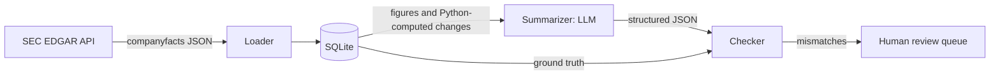

# EDGAR Financial Statement Summarizer

A Python pipeline that loads annual 10-K figures for five US public companies from the SEC EDGAR API into SQLite, uses an LLM to write structured JSON summaries of year-over-year changes, and validates every figure the model cites against the database before anything reaches a reader.

> **Status: early development.** The repository scaffold, design document and EDGAR exploration scripts are in place. The loader, summarizer and checker are next. See the [roadmap](#roadmap) and the [DEVLOG](DEVLOG.md).

## The core idea

**Python does the math, the LLM only writes the narrative, and a checker verifies every number the model cites.**

LLMs are good at turning figures into readable prose. They are unreliable at arithmetic, and they will happily invent explanations the data can't support. So this pipeline splits the work:

1. **Figures and year-over-year changes are computed in Python** from values loaded directly out of SEC filings.
2. **The LLM receives those figures and returns a structured JSON summary**, citing each figure by metric and fiscal year.
3. **A validation layer looks up every cited figure in the database**, recomputes each change, scans the narrative text for numbers that weren't in the input, and flags anything that doesn't match for human review.

## How it works



| Stage | Input | Output |
|---|---|---|
| Loader | EDGAR companyfacts JSON | `financials` table with one value per company, metric and fiscal year |
| Summarizer | The two most recent fiscal years for a company | JSON summary with metric-level highlights |
| Checker | A summary plus the database | Pass, or flags for human review |

Design details, including the database schema, XBRL tag mapping and validation rules, are in [DESIGN.md](DESIGN.md).

**Metrics:** revenue, net income, operating cash flow, total assets, total liabilities and diluted EPS.

## Roadmap

**Week 1: get the data right**

- [x] Repository, `.gitignore` and environment template
- [x] Design document covering schema, metric tag mapping and validation approach
- [x] EDGAR fetch and exploration scripts
- [ ] Select companies and document the reasons
- [ ] SQLite schema and loader (annual 10-K values only, deduplicated comparatives, revenue tag mapping)
- [ ] Verify loaded figures against the original 10-K filings

**Week 2: add the AI, then distrust it**

- [ ] First LLM summary in a fixed JSON format
- [ ] Graceful handling of malformed responses; run for all companies
- [ ] Validation layer: figure lookup, recomputed changes, narrative number scan
- [ ] pytest suite, including tests that plant wrong figures and confirm they are caught
- [ ] Manual review of every summary; prompt tightened against unsupported explanations
- [ ] Final README with example output and limitations
- [ ] Fresh-clone test following this README exactly

## Repository structure

```
├── scripts/
│   ├── fetch_facts.py      # look up CIKs and download raw companyfacts JSON
│   ├── explore_facts.py    # inspect which XBRL tags a company uses, and when
│   └── check_api_key.py    # confirm the LLM API key works
├── DESIGN.md               # schema, tag mapping and validation design
├── DEVLOG.md               # what broke, what was surprising, how it was caught
├── requirements.txt
└── .env.example            # template for local secrets (the real .env is gitignored)
```

## Setup

Requires Python 3.10 or later.

```bash
git clone https://github.com/<your-username>/edgar-financial-summarizer.git
cd edgar-financial-summarizer
python -m venv .venv
source .venv/bin/activate          # Windows: .venv\Scripts\activate
pip install -r requirements.txt
cp .env.example .env               # Windows: copy .env.example .env
```

Then open `.env` and fill in your values.

Fetch and explore a company:

```bash
python scripts/fetch_facts.py AAPL
python scripts/explore_facts.py AAPL
```

## API keys and secrets

- Keys live only in a local `.env` file, which is listed in `.gitignore` and never committed. `.env.example` shows the required variables with placeholder values.
- The LLM API account has a monthly spend limit, so a bug can't run up an open-ended bill.
- The SEC requires every request to carry a `User-Agent` header identifying the requester. The scripts read it from `SEC_USER_AGENT` in `.env` and stay well under the SEC's limit of 10 requests per second.

## Data source

All figures come from the SEC EDGAR XBRL company facts API (`data.sec.gov/api/xbrl/companyfacts/`), as tagged by each company in its own filings. Known data limitations will be documented here after the loaded figures are verified against the original 10-K filings.
